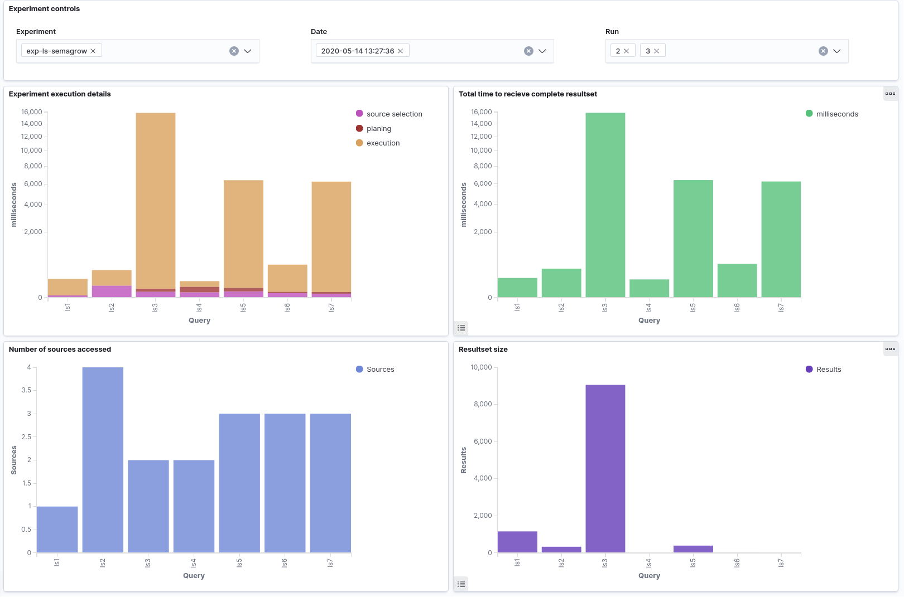
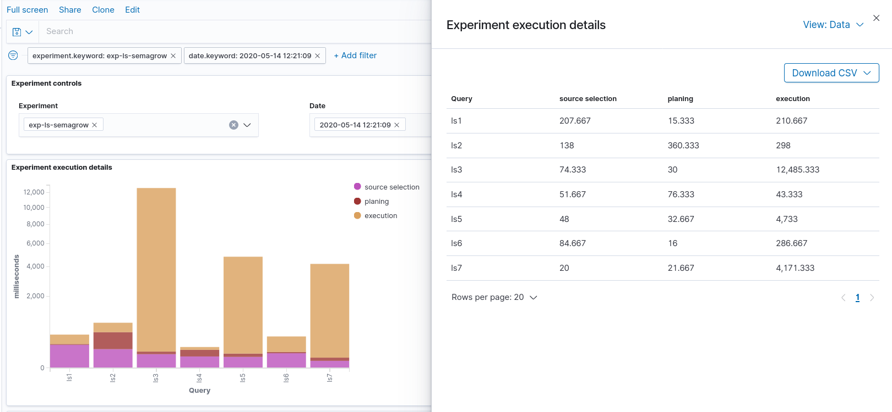
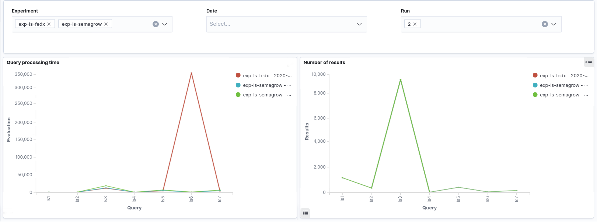
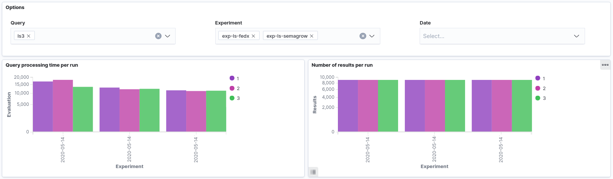

# Evaluate the results

This guide illustrates how to view the results of the benchmark.

## Viewing the Kibana dashboards

In order to view the dashboards you should have installed the Logging
subsystem of KOBE.

After all pods are in Running state Kibana dashboards can be accessed at 
```
http://<NODE-IP>:<NODEPORT>/app/kibana#/dashboard/
``` 
where `<NODE-IP>` the IP of any of the Kubernetes cluster nodes and `<NODEPORT>`
the result of `kubectl get -o jsonpath="{.spec.ports[0].nodePort}" services
kibana-kibana`.

There are three available dashboards, which can be shown below.

## Details of a specific experiment execution

The first dashboard focuses on a specific experiment execution. It comprises:

1. Time of each phase of the query processing for each query of the experiment.
2. Total time to receive the complete result set for each query of the experiment.
3. Number of sources accessed for each query of the experiment.
4. Number of returned results for each query of the experiment.



The first and the third visualizations are obtained from the logs of the
federator engine, if available. The second and the fourth visualizations are obtained
from the logs of the evaluator, so they are available even for federators that do
not provide KOBE-specific logs. The values in each visualization can be also
exported in a CSV file for further processing.



## Comparisons of experiment runs

The remaining two dasbhoards can be used to draw comparisons between several
experiment runs in order to directly compare different configurations of a
benchmark. The following dashboard can be used for comparing several experiment
executions. It consists of two visualizations:

1. Total time to receive the complete result set for each experiment execution.
2. Number of returned results for each specified experiment execution.

Each bar refers to a single query of the experiments presented.



Finally, the last dashboard displays plays the same metrics. The main difference
though, is that it focuses on a specific query and compares all runs of this query
for several experiment executions. Contrary to the visualizations of the other two
dashboards, each bar refers to a single experiment run, and all runs are grouped
according to the experiment execution they belong.



These visualizations are obtained from the logs of the evaluator.


